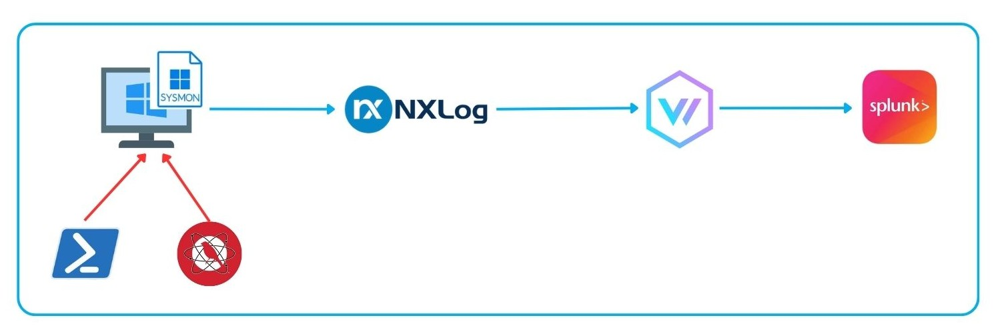
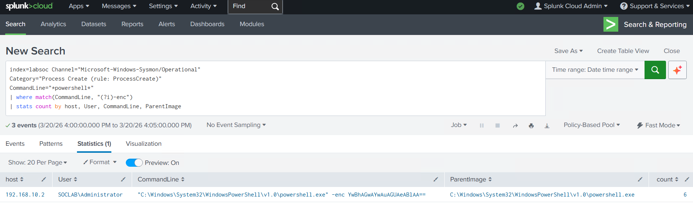
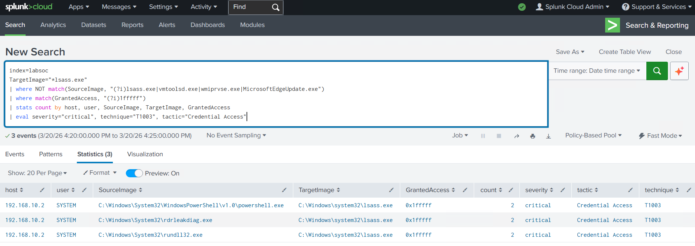
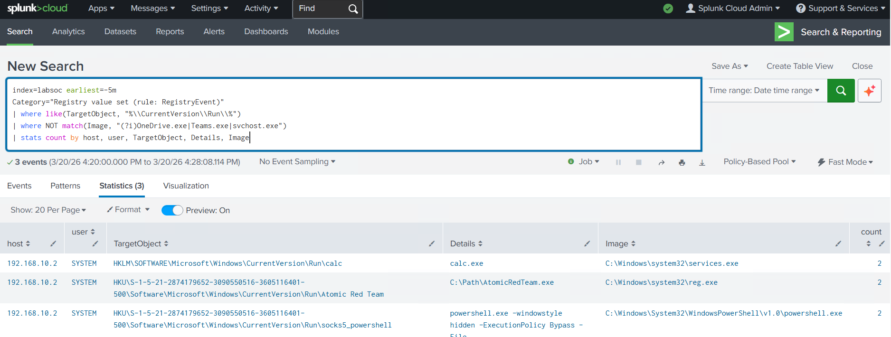
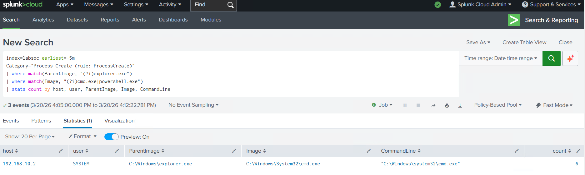
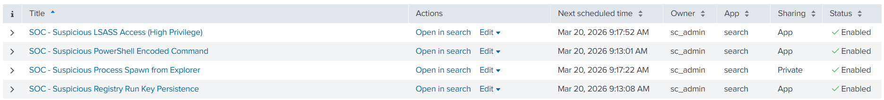
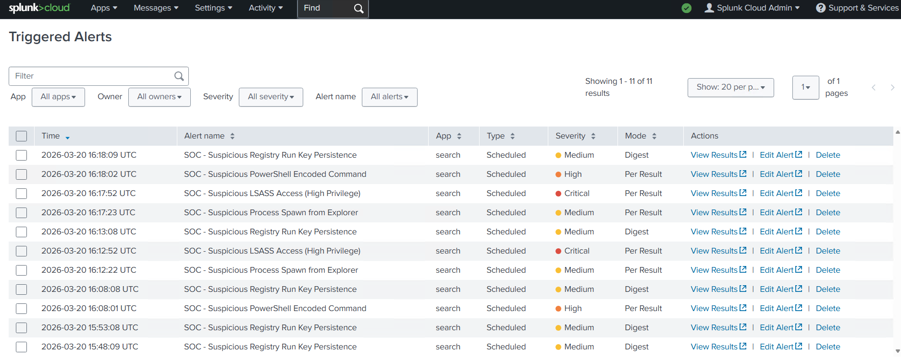
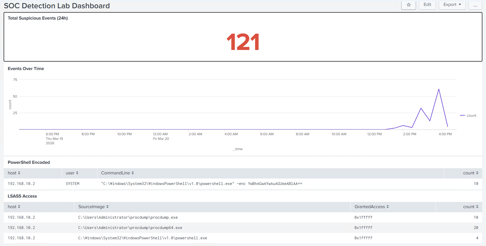
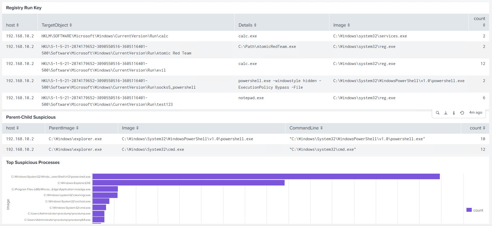

# Detection Engineering Lab – Sysmon + Splunk

Lab này tập trung vào việc xây dựng detection dựa trên log endpoint (Sysmon), với mục tiêu chính là chuyển đổi hành vi tấn công thành các rule phát hiện có thể triển khai trong SIEM.

Thay vì tập trung vào việc dựng hạ tầng, lab đi thẳng vào phần cốt lõi của Detection Engineering: phân tích log, hiểu hành vi attacker và xây dựng detection logic có thể kiểm chứng trong thực tế.

---

## Architecture

Pipeline trong lab:

```
Attack Simulation (Manual / Atomic Red Team)
↓
Windows Endpoint (Sysmon)
↓
NXLog (thu thập log)
↓
Vector (log pipeline)
↓
Splunk (index + detection + alert)
```




### Ghi chú thiết kế

- **Sysmon**: cung cấp telemetry chi tiết (process, registry, access).
- **NXLog**: lấy log từ Windows Event Log.
- **Vector**: đóng vai trò pipeline trung gian (tách ingestion khỏi SIEM).
- **Splunk**: chỉ dùng cho phân tích và detection.

Việc tách pipeline giúp mô phỏng gần với môi trường production (không push log trực tiếp vào SIEM).

---

## Repository Structure
```
├── README.md
├── reports
├── architecture
├── detections
│   ├── parent-child-anomaly
│   ├── lsass-dump
│   ├── powershell-encoded
│   └── registry-persistence
├── alerts
├── dashboards
├── screenshots
└── resources

```

## Detection Methodology

Mỗi detection được xây dựng theo flow:

1. Mô phỏng hành vi attacker (cmd hoặc Atomic Red Team).  
2. Xác định event Sysmon liên quan (Event ID + field).  
3. Phân tích log raw trong Splunk.  
4. Chọn feature phù hợp (CommandLine, ParentImage, TargetObject, …).  
5. Viết SPL.  
6. Chạy lại attack để validate.  
7. Convert thành alert.  

---

## Data Source

Toàn bộ detection dựa trên Sysmon:

| Event ID | Ý nghĩa |
|----------|--------|
| 1 | Process Create |
| 10 | Process Access |
| 13 | Registry Set |

Field chính sử dụng:

- `CommandLine`
- `Image`
- `ParentImage`
- `TargetImage`
- `GrantedAccess`
- `TargetObject`

---

## Detection Use Cases

### 1. PowerShell Encoded Command (T1059.001)

Phát hiện PowerShell chạy với `-enc`.

**Logic:**
- filter PowerShell
- match `-enc` trong CommandLine

**Ý nghĩa:**
Encoded command thường dùng để obfuscate payload.

📄 [chi tiết](./detections/powershell-encoded/README.MD)



---

### 2. LSASS Memory Access (T1003.001)

Phát hiện truy cập vào `lsass.exe`.

**Logic:**
- TargetImage = lsass.exe  
- GrantedAccess = quyền cao (0x1fffff)  
- loại bỏ process hợp lệ  

**Ý nghĩa:**
Hành vi điển hình của credential dumping.

📄 [chi tiết](./detections/lsass-dump/README.md)  



---

### 3. Registry Run Key Persistence (T1547.001)

Phát hiện thay đổi Run key.

**Logic:**
- match đường dẫn `CurrentVersion\\Run`  
- loại bỏ ứng dụng phổ biến  

**Ý nghĩa:**
Persistence phổ biến khi user login.

📄 [chi tiết](./detections/registry-persistence/README.md)  



---

### 4. Parent–Child Process Anomaly (T1059 / T1204)

Phát hiện mối quan hệ process bất thường.

**Logic:**
- child: `cmd.exe`, `powershell.exe`  
- parent: Word, Excel, Outlook, Explorer  

**Ý nghĩa:**
Một số cặp parent-child gần như luôn đáng nghi (ví dụ Word → PowerShell).

📄 [chi tiết](./detections/parent-child-anomaly/README.md)  



---

## 🚨 Alerts

- Alert được tạo từ các SPL detection
- Trigger khi có kết quả
- Chạy định kỳ (ví dụ 5 phút)

📄 [alert](./alerts/alerts.md)  




---

## 📊 Dashboard

Dashboard dùng để:

- xem tổng số event đáng nghi  
- theo dõi trend theo thời gian  
- xem top process  

📄 [dashboard SPL](./dashboards/dashboard.spl)  




---

## Skills

- Phân tích log endpoint với Sysmon (process, registry, process access).
- Viết detection rule bằng SPL trong Splunk.
- Hiểu và mapping hành vi tấn công theo MITRE ATT&CK.
- Xây dựng detection theo hướng behavior-based.
- Thiết kế pipeline log: Sysmon → NXLog → Vector → Splunk.
- Mô phỏng tấn công bằng Atomic Red Team để validate detection.
- Xây dựng alert và dashboard trong môi trường SIEM.
- Phân tích và giảm false positive trong detection.

---

## Insights

- Detection không phải là viết SPL, mà là hiểu hành vi  
- Sysmon đủ để detect phần lớn kỹ thuật phổ biến  
- Những dấu hiệu nhỏ (ví dụ `-enc`, parent-child) có giá trị rất lớn  
- Giảm false positive cần context, không chỉ filter  

---

## Limitations

- Detection đơn lẻ (chưa có correlation nhiều bước)  
- Chưa có enrichment (user context, threat intel)  
- Một số case vẫn có false positive  

---

## Improvements

- Viết detection dạng correlation (multi-stage)  
- Xây baseline hành vi người dùng  
- Thêm context (user, host, frequency)  
- Tích hợp automation (SOAR)  

---

## Summary

Lab này đi từ log thô → detection có thể dùng được.

Trọng tâm không phải là tool, mà là khả năng:

- đọc log  
- hiểu hành vi  
- và biến nó thành detection  
